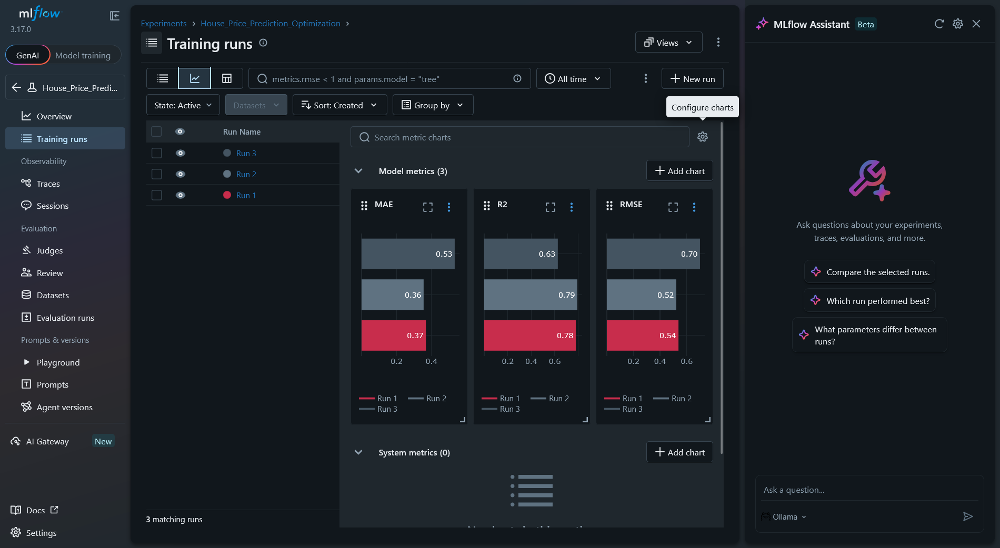
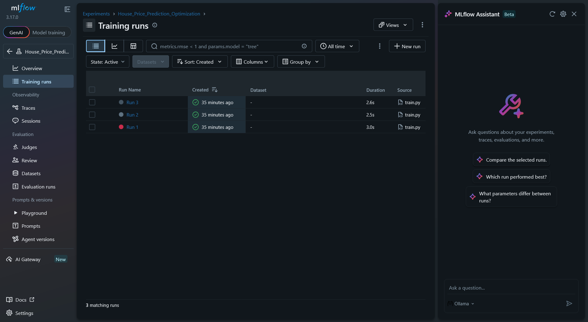
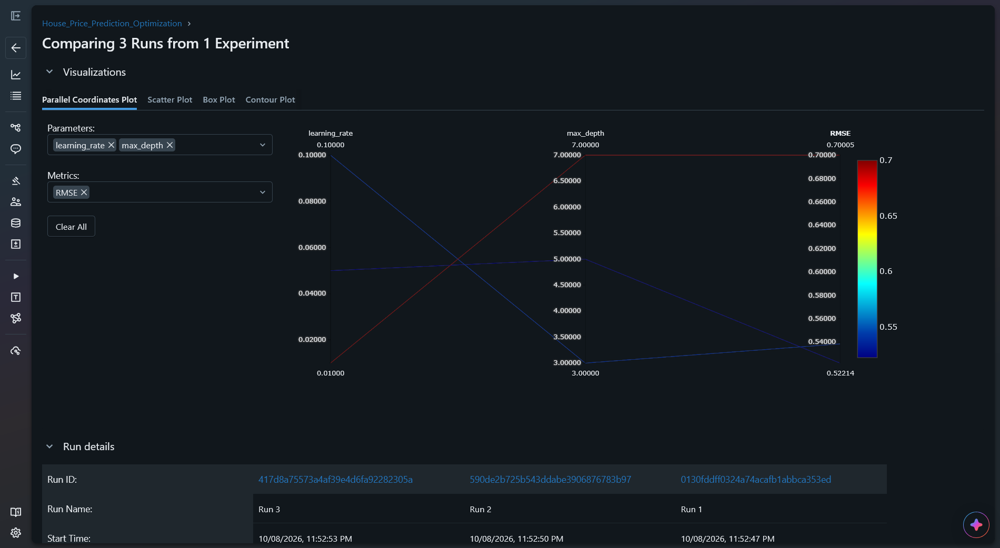

# MLOps Task: ML Experiment Tracking with MLflow

## 1. Description
This project demonstrates experiment tracking using MLflow for a House Price Prediction model (California Housing dataset, XGBoost). Multiple runs with different hyperparameters are logged and compared, and the best model is selected based on RMSE. The best model is then served as a REST API with FastAPI and deployed to a local Kubernetes cluster (Minikube).

## 2. How to Run

1. **Create and activate a virtual environment:**
```bash
   python3 -m venv mlops-env
   source mlops-env/bin/activate
```

2. **Install dependencies:**
```bash
   pip install -r requirements.txt
```

3. **Start the MLflow UI server:**
```bash
   mlflow ui
```

4. **Run the training script (in a separate terminal with the environment activated):**
```bash
   python train.py
```

5. **View the results:** Open `http://127.0.0.1:5000` in your web browser.

## 3. Experiment Comparison Table

| Run Name | Max Depth | Learning Rate | RMSE | MAE | R² |
|----------|-----------|---------------|------|------|------|
| Run 1 | 3 | 0.1 | 0.54 | 0.37 | 0.78 |
| **Run 2 (Best)** | **5** | **0.05** | **0.52** | **0.36** | **0.79** |
| Run 3 | 7 | 0.01 | 0.70 | 0.53 | 0.63 |

## 4. Selected Best Model

- **Selected Model:** Run 2
- **Why?** Run 2 achieved the lowest **RMSE (0.52)** and the highest **R² (0.79)** among all runs. Since RMSE is the primary metric for model selection in this task, Run 2 provides the best predictive performance and generalization balance on the validation dataset.

### Registering the Best Model
In the MLflow UI, open the Run 2 model (`xgboost-model`), click **Register model**, and name it `California_Housing_Predictor`. Then set the alias `staging` on Version 1.

## 5. MLflow UI Screenshots





## 6. Model Deployment

### Overview
The registered best model (`Run 2`) was exported and containerized into a REST API using FastAPI, then deployed to a local Kubernetes cluster using Minikube with a 2-replica Deployment and a LoadBalancer Service.

### Project Files
- `export_model.py`: downloads the registered model into `./model`
- `app.py`: FastAPI serving code (`/health` and `/predict`)
- `Dockerfile` and `.dockerignore`: container build
- `k8s-deployment.yaml`: Kubernetes Deployment and Service

### Prerequisites
Docker, `kubectl`, and `minikube` must be installed (on WSL).

### Deployment Steps

1. **Export the registered model** (make sure `mlflow ui` is running):
```bash
   python export_model.py
```
   This creates the `./model` folder, which the Dockerfile copies into the image.

2. **Start Minikube:**
```bash
   minikube start --driver=docker
```

3. **Build Docker Image & Load to Minikube:**
```bash
   docker build -t california-housing-api:v1 .
   minikube image load california-housing-api:v1
```

4. **Apply Kubernetes Manifest and check the pods:**
```bash
   kubectl apply -f k8s-deployment.yaml
   kubectl get pods
```

5. **Port Forwarding:**
```bash
   kubectl port-forward svc/housing-api-service 8080:80
```

6. **Test Prediction:**
```bash
   curl -X 'POST' \
     'http://127.0.0.1:8080/predict' \
     -H 'accept: application/json' \
     -H 'Content-Type: application/json' \
     -d '{
     "MedInc": 8.3252,
     "HouseAge": 41.0,
     "AveRooms": 6.9841,
     "AveBedrms": 1.0238,
     "Population": 322.0,
     "AveOccup": 2.5556,
     "Latitude": 37.88,
     "Longitude": -122.23
   }'
```

   Expected response:
```json
   {"prediction": "$272,888.04"}
```